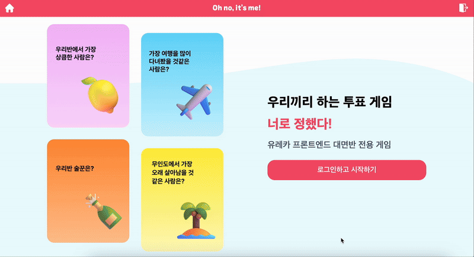
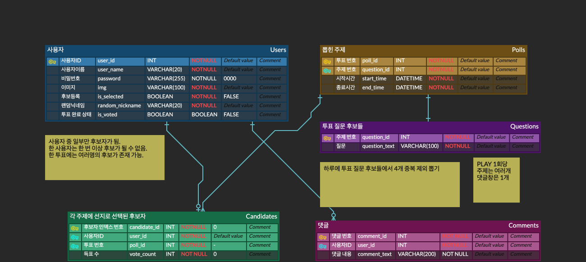
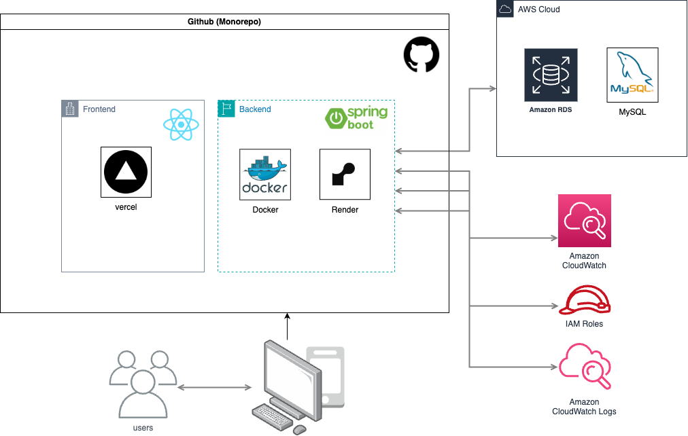

# 👊 너로 정했다! (Oh no, It's me!)

> 익명 투표로 즐기는 밸런스 게임 & 커뮤니티 플랫폼

### 👉 [서비스 바로가기](https://oh-no-its-me.vercel.app/)

## 🚀 프로젝트 소개

유레카 프론트엔드 대면반 2기의 하루 활기를 복돋아줄 **익명 투표 기반 밸런스 게임 & 커뮤니티 플랫폼**입니다.

### ⏳ 프로젝트 개발 기간

| 기간                    | 작업 내용     | 기간 (일) |
| :---------------------- | :------------ | :-------- |
| 2025.03.13 ~ 2025.03.21 | Backend 개발  | 7일       |
| 2025.03.24 ~ 2025.03.31 | Figma 디자인  | 5일       |
| 2025.05.07 ~ 2025.05.20 | Frontend 개발 | 13일      |

### 👥 팀원 소개

| 이영주👑                                                                    | 박은서                                                                      | 이다예                                                                       | 진영호                                                                       |
| --------------------------------------------------------------------------- | --------------------------------------------------------------------------- | ---------------------------------------------------------------------------- | ---------------------------------------------------------------------------- |
|  |  |  |  |
| [@abyss-s](https://github.com/abyss-s)                                      | [@arty0928](https://github.com/arty0928)                                    | [@leedaye0412](https://github.com/leedaye0412)                               | [@kuru2141](https://github.com/kuru2141)                                     |

## 🌟 주요 기능

| 기능                 | 설명                                                                                             |
| :------------------- | :----------------------------------------------------------------------------------------------- |
| 🗳 **투표 진행**      | 유레카 프론트엔드 대면반 멤버들이 등장하는 밸런스 게임. 4명 중 한 명을 반드시 선택해 투표에 참여 |
| 🏆 **랭킹 시스템**   | 제한 시간 동안 투표를 진행하고, 마감 후 1위를 공개                                               |
| 💬 **익명 커뮤니티** | 로그인 시 랜덤 닉네임이 자동 부여되며, 익명 댓글창에서 자유롭게 소통 가능                        |

## 🛠️ 기술 스택

| 카테고리           | 스택                                                                                                                                                                                                                                                                                                                                                                                                                                                                                                                                                                                                                                                                                                                                                                                             |
| :----------------- | :----------------------------------------------------------------------------------------------------------------------------------------------------------------------------------------------------------------------------------------------------------------------------------------------------------------------------------------------------------------------------------------------------------------------------------------------------------------------------------------------------------------------------------------------------------------------------------------------------------------------------------------------------------------------------------------------------------------------------------------------------------------------------------------------- |
| **Frontend**       |        |
| **Backend**        |                                                                                                                                                                                                                                                                                                                                                                                                                                                               |
| **DevOps / Infra** |                                                                                                                                                                                                                                                                                                                                                        |

## 📌 ERD Diagram

## 📑 API Documents

[🔗 Notion API 명세서 확인하기](https://lowly-brian-a99.notion.site/1af64f2ada64805da616db17bceb4efe?v=1af64f2ada64813ba8ac000c12b30f1f)

## 📂 System Architecture

